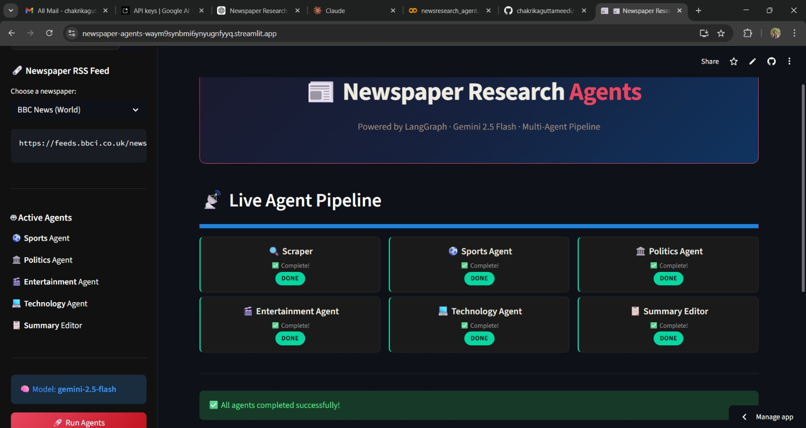
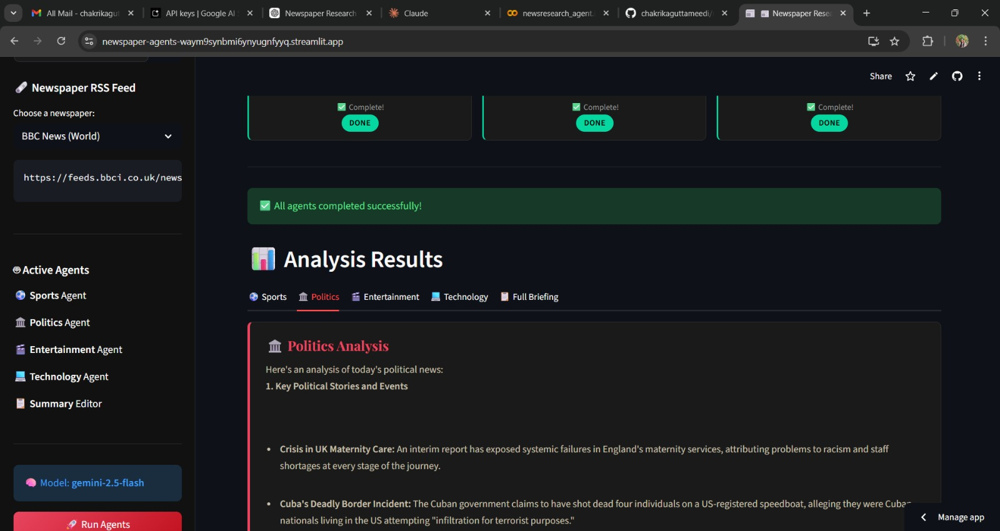

# 📰 Newspaper Research Agents

A multi-agent AI pipeline built with **LangGraph**, **Google Gemini 2.5 Flash**, and **Streamlit** that scrapes newspaper RSS feeds and analyzes the content across four specialized domains — Sports, Politics, Entertainment, and Technology — then compiles everything into a unified daily briefing.

---

## 🚀 Features

- 🔍 **RSS Scraper** — Automatically fetches the latest articles from any RSS feed or newspaper URL
- ⚽ **Sports Agent** — Extracts match results, teams, players, and upcoming events
- 🏛️ **Politics Agent** — Analyzes political stories, policy changes, and key figures
- 🎬 **Entertainment Agent** — Covers celebrity news, movies, TV shows, and music
- 💻 **Technology Agent** — Reports on AI, gadgets, startups, and tech innovations
- 📋 **Summary Editor** — Compiles all agent outputs into a clean Daily News Briefing
- 📡 **Live Pipeline View** — Real-time status updates (WAITING → RUNNING → DONE) for each agent
- 🎨 **Dark Newspaper UI** — Elegant dark-themed interface with Playfair Display typography

---

## 🛠️ Tech Stack

| Tool | Purpose |
|------|---------|
| [Streamlit](https://streamlit.io/) | Web UI framework |
| [LangGraph](https://github.com/langchain-ai/langgraph) | Multi-agent pipeline orchestration |
| [LangChain](https://www.langchain.com/) | LLM abstraction layer |
| [Google Gemini 2.5 Flash](https://ai.google.dev/) | LLM powering all agents |
| [feedparser](https://feedparser.readthedocs.io/) | RSS feed parsing |
| [BeautifulSoup4](https://www.crummy.com/software/BeautifulSoup/) | HTML scraping fallback |
| [Requests](https://docs.python-requests.org/) | HTTP requests |

---

## 📦 Installation

### 1. Clone the repository

```bash
git clone https://github.com/your-username/newspaper-research-agents.git
cd newspaper-research-agents
```

### 2. Install dependencies

```bash
pip install -r requirements.txt
```

### 3. Run the app

```bash
streamlit run app.py
```

---

## 🔑 Setup

1. Get a **Gemini API Key** from [Google AI Studio](https://aistudio.google.com/app/apikey)
2. Open the app in your browser (usually `http://localhost:8501`)
3. Paste your API key in the sidebar
4. Select a preset newspaper or enter a custom RSS URL
5. Click **🚀 Run Agents**

---

## 🗞️ Preset Newspapers

| Source | Feed |
|--------|------|
| BBC News (World) | `https://feeds.bbci.co.uk/news/rss.xml` |
| BBC Sport | `https://feeds.bbci.co.uk/sport/rss.xml` |
| BBC Technology | `https://feeds.bbci.co.uk/news/technology/rss.xml` |
| Times of India | `https://timesofindia.indiatimes.com/rssfeeds/296589292.cms` |
| Custom URL | Enter any RSS feed URL |

---

## 🧠 Agent Pipeline

```
RSS Feed URL
     │
     ▼
[Scraper Node] ──► Fetches up to 10 articles
     │
     ▼
[Sports Agent] ──► Analyzes sports content
     │
     ▼
[Politics Agent] ──► Analyzes political content
     │
     ▼
[Entertainment Agent] ──► Analyzes entertainment content
     │
     ▼
[Technology Agent] ──► Analyzes tech content
     │
     ▼
[Summary Editor] ──► Compiles Daily News Briefing
```

All nodes are orchestrated sequentially using **LangGraph's StateGraph**.

---

## 📁 Project Structure

```
newspaper-research-agents/
│
├── app.py               # Main Streamlit application
├── requirements.txt     # Python dependencies
├── README.md            # Project documentation
└── outputs/
    ├── 1.jpeg           # Output screenshot 1
    └── 2.jpeg           # Output screenshot 2
```

---

## 📸 Outputs

**1**



**2**



---

## ⚠️ Notes

- Each agent has a built-in **10-second delay** to respect Gemini API rate limits
- If you encounter a **429 / RESOURCE_EXHAUSTED** error, wait 1–2 minutes and try again
- The scraper first attempts RSS parsing; if no entries are found, it falls back to HTML headline scraping

---

## 📄 License

This project is open-source and available under the [MIT License](LICENSE).
